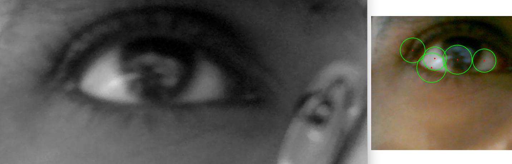

# EyeCan 

**A spectacle-like wearable device that enables computer control through eye movements, designed to enhance accessibility for individuals with disabilities.**

## 📋 Overview

EyeCan is a wearable assistive technology that uses real-time eye movement monitoring to enable individuals with mobility impairments to control computers. The device resembles regular spectacles but incorporates a camera system that tracks eye gestures and translates them into computer commands.

## 🎬 Demo


*Video: Working demonstration of the EyeCan in action*

## ✨ Features

- **Real-time eye movement tracking** using MediaPipe and OpenCV
- **Gesture recognition** via Hough Circle Transform algorithm
- **Advanced detection** through custom CNN models
- **Hands-free computer control** through calibrated eye movements
- **Low latency response** for natural interaction
- **Comfortable wearable design** for extended use

## 🖼️ How It Works


*Image: OpenCV eye detection and tracking visualization*

Our system uses a multi-stage approach to translate eye movements into computer commands:

1. **Capture**: Camera mounted on spectacles captures eye region
2. **Detection**: MediaPipe facial landmark detection locates precise eye position
3. **Tracking**: OpenCV processes eye movements in real-time
4. **Recognition**: Hough Circle Transform algorithm detects pupil position and movement
5. **Classification**: CNN models interpret movements as specific commands
6. **Action**: Commands are translated into computer inputs




*Image: Visualization of the eye movement detection algorithm*

## 🔧 Technologies

- **Computer Vision**: OpenCV, MediaPipe
- **Machine Learning**: Custom CNN models
- **Hardware**: Raspberry Pi Zero (or similar), specialized camera module
- **Programming**: Python

## 🚀 Getting Started

### Prerequisites

```
torch==2.1.0
ultralytics==8.0.230
opencv-python==4.10.0
numpy
pillow
math
streamlit

```

### Installation

```bash
# Clone the repository
git clone https://github.com/Harish-ioc/EyeCan.git

# Navigate to the project directory
cd EyeCan

# Install dependencies
pip install -r requirements.txt

# Run the application
streamlit run main_streamlit.py

```

## 🔍 Usage

1. **Setup**: Position the device comfortably on your face like regular glasses
2. **Calibration**: Follow the on-screen prompts to calibrate the system

## 💡 Impact

This technology aims to:
- Enhance accessibility for individuals with mobility impairments
- Create new employment opportunities
- Promote digital inclusion
- Enable greater independence in computer use

## 🛣️ Roadmap

- [ ] Improve gesture recognition accuracy
- [ ] Add customizable gesture mappings
- [ ] Reduce hardware size and weight
- [ ] Develop wireless version
- [ ] Create mobile application support
- [ ] Implement eye-typing with word prediction

## 🤝 Contributing

Contributions to improve EyeCan are welcome! Please feel free to submit a Pull Request.

## 📄 License

This project is licensed under the MIT License - see the [LICENSE](LICENSE) file for details.
